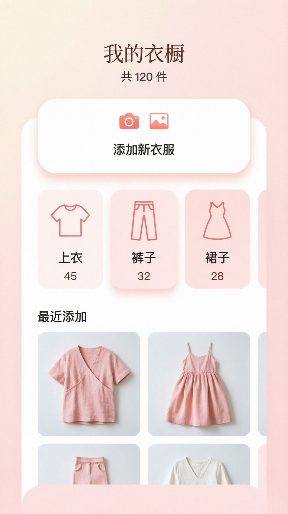

# 首页需求文档 (HomeScreen)

## 📋 页面概述

**页面名称：** 首页 (HomeScreen)  
**页面路径：** `/home`  
**访问方式：** App 启动默认页  
**核心目标：** 提供快速入口，解决"找不到衣服"的痛点

---

## 🎯 功能需求

### 1. 顶部标题区

**功能描述：**
- 显示 App 名称 "我的衣橱"
- 显示衣服总数 "共 XX 件"

**数据来源：**
```sql
SELECT COUNT(*) as total FROM clothes
```

**交互逻辑：**
- 无交互，纯展示
- 实时更新总数

---

### 2. 快速添加区

**功能描述：**
- 大按钮 "添加新衣服"
- 两个快捷入口：拍照 / 相册

**交互逻辑：**
- 点击 "添加新衣服" → 跳转到添加页
- 点击 "📷 拍照" → 打开相机 → 拍照 → 跳转添加页（带图片）
- 点击 "🖼️ 相册" → 打开相册 → 选择图片 → 跳转添加页（带图片）

**数据传递：**
```javascript
// 跳转参数
{
  imageUri: 'file://...', // 图片路径
  source: 'camera' | 'album' // 来源
}
```

---

### 3. 分类入口区

**功能描述：**
- 展示 3-4 个主要分类
- 每个分类显示：图标 + 名称 + 数量
- 卡片式设计

**分类列表：**
| 分类 | 图标 | 说明 |
|------|------|------|
| 上衣 | 👕 | T恤、衬衫、毛衣等 |
| 裤子 | 👖 | 牛仔裤、休闲裤等 |
| 裙子 | 👗 | 连衣裙、半身裙等 |
| 鞋子 | 👟 | 运动鞋、高跟鞋等 |

**数据来源：**
```sql
SELECT category, COUNT(*) as count 
FROM clothes 
WHERE category IN ('上衣', '裤子', '裙子', '鞋子')
GROUP BY category
```

**交互逻辑：**
- 点击分类卡片 → 跳转到浏览页（带分类筛选）

**跳转参数：**
```javascript
{
  category: '上衣' // 选择的分类
}
```

---

### 4. 最近添加区

**功能描述：**
- 展示最近添加的 4 件衣服
- 2x2 网格布局
- 缩略图 + 分类标签

**数据来源：**
```sql
SELECT id, image_path, category, created_at
FROM clothes
ORDER BY created_at DESC
LIMIT 4
```

**交互逻辑：**
- 点击衣服卡片 → 跳转到详情页

**跳转参数：**
```javascript
{
  clothesId: 123 // 衣服 ID
}
```

---

## 🎨 UI 设计

**设计图：**


**设计要点：**
- 配色：温柔粉色系
- 布局：垂直滚动
- 卡片：圆角 16px
- 阴影：柔和阴影效果

---

## 📊 数据结构

### 页面状态
```typescript
interface HomeState {
  totalCount: number;           // 衣服总数
  categories: CategoryCount[];  // 分类统计
  recentItems: Clothes[];       // 最近添加
  loading: boolean;             // 加载状态
}

interface CategoryCount {
  category: string;  // 分类名称
  count: number;     // 数量
  icon: string;      // 图标
}

interface Clothes {
  id: number;
  imagePath: string;
  category: string;
  createdAt: string;
}
```

---

## 🔄 生命周期

### 页面加载
```javascript
useEffect(() => {
  loadData();
}, []);

const loadData = async () => {
  setLoading(true);
  await Promise.all([
    loadTotalCount(),
    loadCategories(),
    loadRecentItems()
  ]);
  setLoading(false);
};
```

### 页面刷新
```javascript
// 从其他页面返回时刷新数据
useFocusEffect(
  React.useCallback(() => {
    loadData();
  }, [])
);
```

---

## 🎯 性能优化

### 图片加载
- 使用缩略图（200x200）
- 懒加载
- 缓存机制

### 数据缓存
- 分类统计缓存（5分钟）
- 总数实时更新
- 最近添加实时更新

---

## 🔧 技术要点

### 1. 图片处理
```javascript
import ImagePicker from 'react-native-image-crop-picker';

// 拍照
const openCamera = async () => {
  const image = await ImagePicker.openCamera({
    width: 800,
    height: 800,
    cropping: true,
  });
  navigate('AddClothes', { imageUri: image.path });
};

// 相册
const openPicker = async () => {
  const image = await ImagePicker.openPicker({
    width: 800,
    height: 800,
    cropping: true,
  });
  navigate('AddClothes', { imageUri: image.path });
};
```

### 2. 数据查询
```javascript
// 获取分类统计
const getCategories = async () => {
  const db = await getDBConnection();
  const results = await db.executeSql(`
    SELECT category, COUNT(*) as count 
    FROM clothes 
    GROUP BY category
  `);
  return results[0].rows.raw();
};
```

---

## ✅ 验收标准

### 功能验收
- [ ] 显示正确的衣服总数
- [ ] 分类数量正确
- [ ] 最近添加显示正确
- [ ] 拍照功能正常
- [ ] 相册选择功能正常
- [ ] 页面跳转正常

### UI 验收
- [ ] 配色符合设计稿
- [ ] 布局合理
- [ ] 卡片圆角正确
- [ ] 阴影效果正确
- [ ] 图标显示正确

### 性能验收
- [ ] 页面加载 < 1秒
- [ ] 图片加载流畅
- [ ] 无明显卡顿

---

## 📝 备注

**优先级：** P0（最高）  
**预计工时：** 1天  
**依赖页面：** 添加页、浏览页、详情页  
**风险点：** 图片处理性能
