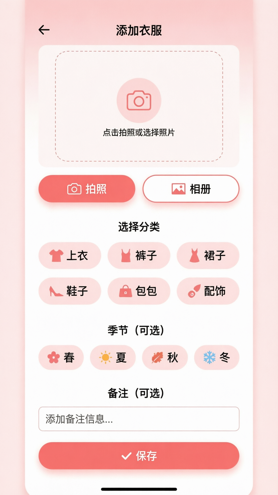

# 添加衣服页需求文档 (AddClothesScreen)

## 📋 页面概述

**页面名称：** 添加衣服页 (AddClothesScreen)  
**页面路径：** `/add-clothes`  
**访问方式：** 从首页快速添加入口进入  
**核心目标：** 快速录入衣服信息，3步30秒完成

---

## 🎯 功能需求

### 1. 顶部导航栏

**功能描述：**
- 返回按钮 "←"
- 标题 "添加衣服"

**交互逻辑：**
- 点击 "←" → 返回上一页（不保存）

---

### 2. 图片预览区

**功能描述：**
- 显示已选择/拍摄的图片
- 占位符：未选择图片时显示相机图标

**交互逻辑：**
- 从首页带图片进入 → 显示图片
- 未带图片 → 显示占位符

**占位符设计：**
- 圆形相机图标（粉色）
- 提示文字 "点击拍照或选择照片"
- 虚线边框

---

### 3. 操作按钮区

**功能描述：**
- 两个按钮：拍照 / 相册
- 并排显示

**交互逻辑：**

**拍照按钮：**
```
点击 → 打开相机 → 拍照 → 裁剪 → 显示在预览区
```

**相册按钮：**
```
点击 → 打开相册 → 选择图片 → 裁剪 → 显示在预览区
```

**图片处理：**
- 自动裁剪为 1:1 比例
- 压缩质量：80%
- 最大尺寸：800x800

---

### 4. 分类选择区

**功能描述：**
- 标题 "选择分类"
- 6 个分类选项（2x3 网格）
- 单选模式

**分类列表：**
| 序号 | 图标 | 名称 | 说明 |
|------|------|------|------|
| 1 | 👕 | 上衣 | T恤、衬衫、毛衣、外套等 |
| 2 | 👖 | 裤子 | 牛仔裤、休闲裤、西裤等 |
| 3 | 👗 | 裙子 | 连衣裙、半身裙等 |
| 4 | 👟 | 鞋子 | 运动鞋、高跟鞋、靴子等 |
| 5 | 👜 | 包包 | 手提包、双肩包、斜挎包等 |
| 6 | 🧣 | 配饰 | 围巾、帽子、手套、首饰等 |

**交互逻辑：**
- 默认未选择
- 点击选中 → 高亮显示（珊瑚粉背景）
- 再次点击取消选择
- **必须选择**（否则无法保存）

**验证规则：**
```javascript
if (!selectedCategory) {
  showError('请选择分类');
  return;
}
```

---

### 5. 季节选择区（可选）

**功能描述：**
- 标题 "季节（可选）"
- 4 个季节选项（横向排列）
- 多选模式

**季节列表：**
| 图标 | 名称 | 说明 |
|------|------|------|
| 🌸 | 春 | 春季穿着 |
| ☀️ | 夏 | 夏季穿着 |
| 🍂 | 秋 | 秋季穿着 |
| ❄️ | 冬 | 冬季穿着 |

**交互逻辑：**
- 可选择 0-4 个季节
- 默认不选
- 选中状态：粉色背景 + 勾选图标

**数据存储：**
```javascript
seasons: ['春', '夏'] // 数组格式
```

---

### 6. 备注输入区（可选）

**功能描述：**
- 标题 "备注（可选）"
- 文本输入框
- 占位符 "添加备注信息..."

**输入限制：**
- 最大长度：200 字符
- 多行输入（最多 3 行）

**交互逻辑：**
- 输入框获得焦点 → 显示键盘
- 输入框失去焦点 → 收起键盘

---

### 7. 保存按钮

**功能描述：**
- 底部大按钮 "✓ 保存"
- 固定在底部

**交互逻辑：**
```
点击保存 → 验证数据 → 保存到数据库 → 返回首页
```

**验证规则：**
```javascript
// 必填验证
if (!imageUri) {
  showError('请选择图片');
  return;
}

if (!selectedCategory) {
  showError('请选择分类');
  return;
}

// 保存数据
await saveClothes({
  imagePath: imageUri,
  category: selectedCategory,
  seasons: selectedSeasons,
  notes: notes
});
```

---

## 🎨 UI 设计

**设计图：**


**设计要点：**
- 图片预览区占屏幕 30%
- 分类选择醒目
- 保存按钮固定底部
- 珊瑚粉强调色

---

## 📊 数据结构

### 页面状态
```typescript
interface AddClothesState {
  imageUri: string | null;      // 图片路径
  category: string | null;      // 分类
  seasons: string[];            // 季节
  notes: string;                // 备注
  saving: boolean;              // 保存中
}

interface SaveClothesParams {
  imagePath: string;
  category: string;
  seasons: string[];
  notes: string;
}
```

### 数据库存储
```sql
INSERT INTO clothes (
  image_path,
  category,
  season,
  notes,
  created_at,
  updated_at
) VALUES (?, ?, ?, ?, ?, ?)
```

---

## 🔄 业务流程

### 完整录入流程
```
1. 进入页面
   ↓
2. 选择/拍摄图片
   ↓
3. 选择分类（必选）
   ↓
4. 选择季节（可选）
   ↓
5. 输入备注（可选）
   ↓
6. 点击保存
   ↓
7. 验证数据
   ↓
8. 保存到数据库
   ↓
9. 返回首页
```

### 异常处理
```
- 图片选择失败 → 提示重试
- 分类未选择 → 提示选择
- 保存失败 → 提示错误信息
```

---

## 🔧 技术要点

### 1. 图片处理
```javascript
import ImagePicker from 'react-native-image-crop-picker';

const openCamera = async () => {
  try {
    const image = await ImagePicker.openCamera({
      width: 800,
      height: 800,
      cropping: true,
      cropperCircleOverlay: false,
      compressImageQuality: 0.8,
    });
    setImageUri(image.path);
  } catch (error) {
    if (error.code !== 'E_PICKER_CANCELLED') {
      showError('拍照失败，请重试');
    }
  }
};
```

### 2. 数据保存
```javascript
const saveClothes = async () => {
  // 验证
  if (!imageUri) {
    Alert.alert('提示', '请选择图片');
    return;
  }
  
  if (!category) {
    Alert.alert('提示', '请选择分类');
    return;
  }

  setSaving(true);
  
  try {
    const db = await getDBConnection();
    const now = new Date().toISOString();
    
    await db.executeSql(
      `INSERT INTO clothes (
        image_path, category, season, notes,
        created_at, updated_at
      ) VALUES (?, ?, ?, ?, ?, ?)`,
      [imageUri, category, seasons.join(','), notes, now, now]
    );
    
    // 返回首页
    navigation.goBack();
    
  } catch (error) {
    Alert.alert('错误', '保存失败，请重试');
  } finally {
    setSaving(false);
  }
};
```

### 3. 图片存储
```javascript
import RNFS from 'react-native-fs';

const saveImageToLocal = async (uri: string): Promise<string> => {
  const fileName = `clothes_${Date.now()}.jpg`;
  const destPath = `${RNFS.DocumentDirectoryPath}/images/${fileName}`;
  
  // 确保目录存在
  await RNFS.mkdir(`${RNFS.DocumentDirectoryPath}/images`);
  
  // 复制文件
  await RNFS.copyFile(uri, destPath);
  
  return destPath;
};
```

---

## ⏱️ 性能优化

### 图片压缩
- 压缩质量：80%
- 最大尺寸：800x800
- 格式：JPEG

### 保存优化
- 异步保存
- Loading 提示
- 防止重复提交

---

## ✅ 验收标准

### 功能验收
- [ ] 拍照功能正常
- [ ] 相册选择功能正常
- [ ] 图片裁剪正常
- [ ] 分类选择正常
- [ ] 季节选择正常（可选）
- [ ] 备注输入正常（可选）
- [ ] 保存功能正常
- [ ] 数据验证正确
- [ ] 返回首页刷新

### UI 验收
- [ ] 图片预览清晰
- [ ] 分类图标正确
- [ ] 按钮布局合理
- [ ] 配色符合设计
- [ ] 交互反馈明显

### 性能验收
- [ ] 图片处理 < 2秒
- [ ] 保存操作 < 1秒
- [ ] 无内存泄漏

---

## 📝 备注

**优先级：** P0（最高）  
**预计工时：** 2天  
**核心流程：** 拍照 → 分类 → 保存（3步30秒）  
**风险点：** 图片处理性能、存储空间管理
