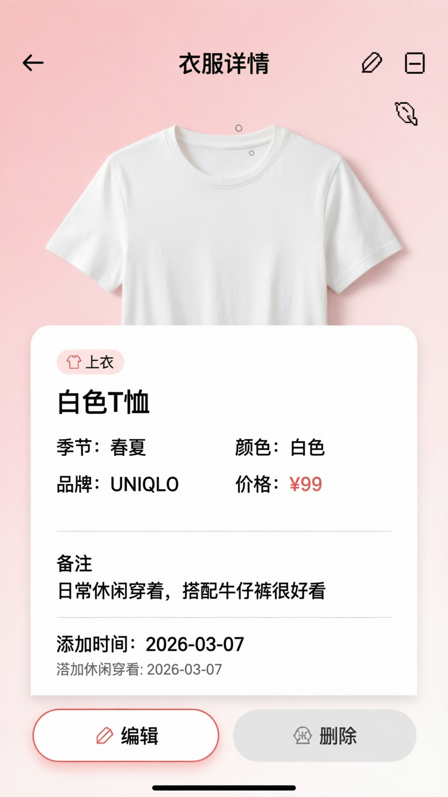

# 衣服详情页需求文档 (ClothesDetailScreen)

## 📋 页面概述

**页面名称：** 衣服详情页 (ClothesDetailScreen)  
**页面路径：** `/clothes-detail`  
**访问方式：** 从浏览页点击衣服卡片进入  
**核心目标：** 查看衣服详细信息，支持编辑和删除

---

## 🎯 功能需求

### 1. 顶部导航栏

**功能描述：**
- 返回按钮 "←"
- 标题 "衣服详情"
- 右侧操作按钮：编辑 ✏️ / 删除 🗑️

**交互逻辑：**

**返回按钮：**
```
点击 ← → 返回上一页
```

**编辑按钮：**
```
点击 ✏️ → 进入编辑模式
```

**删除按钮：**
```
点击 🗑️ → 弹出确认对话框 → 确认删除
```

**删除确认对话框：**
```
标题：确认删除
内容：确定要删除这件衣服吗？此操作不可恢复。
按钮：[取消] [删除]
```

---

### 2. 大图展示区

**功能描述：**
- 全宽展示衣服图片
- 高度占屏幕 40%
- 支持缩放查看（可选）

**交互逻辑：**
- 点击图片 → 全屏查看
- 双指缩放 → 放大细节
- 单击 → 退出全屏

**技术实现：**
```javascript
import ImageViewer from 'react-native-image-zoom-viewer';

<ImageViewer
  imageUrls={[{ url: clothes.imagePath }]}
  enableSwipeDown={true}
  onSwipeDown={() => setShowViewer(false)}
/>
```

---

### 3. 信息展示区（白色卡片）

**功能描述：**
- 白色圆角卡片（顶部圆角）
- 阴影效果
- 包含所有详细信息

#### 3.1 分类标签
```
[👕 上衣]  // 粉色胶囊形状
```

#### 3.2 衣服名称
```
白色T恤  // 大号加粗字体
```

#### 3.3 元数据网格（2列）
```
季节: 春夏        颜色: 白色
品牌: UNIQLO      价格: ¥99
```

**字段说明：**

| 字段 | 说明 | 数据来源 |
|------|------|---------|
| 季节 | 适用的季节 | `season` 字段 |
| 颜色 | 主要颜色 | `color` 字段 |
| 品牌 | 品牌名称 | `brand` 字段 |
| 价格 | 购买价格 | `price` 字段 |

#### 3.4 分隔线
```
─────────────────
```

#### 3.5 备注信息
```
备注
日常休闲穿着，搭配牛仔裤很好看
```

**显示逻辑：**
- 有备注 → 显示备注区
- 无备注 → 不显示

#### 3.6 分隔线
```
─────────────────
```

#### 3.7 时间信息
```
添加时间: 2026-03-07 14:30
```

**格式：**
- YYYY-MM-DD HH:mm
- 灰色小字

---

### 4. 底部操作栏

**功能描述：**
- 固定在底部
- 两个按钮：编辑 / 删除

**按钮设计：**

**编辑按钮：**
- 白色背景
- 粉色边框
- 文字 "✏️ 编辑"

**删除按钮：**
- 浅灰色背景
- 红色文字
- 文字 "🗑️ 删除"

**交互逻辑：**
```
点击编辑 → 跳转到编辑页（预填数据）
点击删除 → 确认对话框 → 删除 → 返回上一页
```

---

### 5. 编辑模式（可选实现）

**功能描述：**
- 点击编辑按钮进入
- 所有字段可编辑
- 保存按钮

**可编辑字段：**
- 名称
- 分类
- 季节
- 颜色
- 品牌
- 价格
- 备注

**交互逻辑：**
```
编辑 → 修改信息 → 保存 → 更新数据库 → 返回查看模式
```

---

## 🎨 UI 设计

**设计图：**


**设计要点：**
- 图片占屏幕 40%
- 信息卡片圆角设计
- 清晰的信息层次
- 操作按钮固定底部

---

## 📊 数据结构

### 页面状态
```typescript
interface ClothesDetailState {
  clothes: Clothes | null;  // 衣服详情
  loading: boolean;         // 加载中
  deleting: boolean;        // 删除中
  editing: boolean;         // 编辑模式
}

interface Clothes {
  id: number;
  name: string;
  category: string;
  season: string;
  color: string;
  brand: string;
  price: number;
  notes: string;
  imagePath: string;
  createdAt: string;
  updatedAt: string;
}
```

---

## 🔄 业务流程

### 查看详情流程
```
1. 从浏览页进入（携带 clothesId）
   ↓
2. 加载衣服详情
   ↓
3. 显示详细信息
   ↓
4. 用户查看/操作
```

### 编辑流程
```
1. 点击编辑按钮
   ↓
2. 跳转到编辑页（预填数据）
   ↓
3. 修改信息
   ↓
4. 保存更改
   ↓
5. 更新数据库
   ↓
6. 返回详情页（刷新数据）
```

### 删除流程
```
1. 点击删除按钮
   ↓
2. 弹出确认对话框
   ↓
3. 用户确认
   ↓
4. 删除数据库记录
   ↓
5. 删除图片文件
   ↓
6. 返回浏览页
```

---

## 🔧 技术要点

### 1. 加载详情
```javascript
const loadClothesDetail = async (clothesId: number) => {
  setLoading(true);
  
  try {
    const db = await getDBConnection();
    const results = await db.executeSql(
      `SELECT * FROM clothes WHERE id = ?`,
      [clothesId]
    );
    
    if (results[0].rows.length > 0) {
      setClothes(results[0].rows.item(0));
    } else {
      Alert.alert('错误', '衣服不存在');
      navigation.goBack();
    }
    
  } catch (error) {
    console.error('加载失败', error);
    Alert.alert('错误', '加载失败，请重试');
  } finally {
    setLoading(false);
  }
};
```

### 2. 删除衣服
```javascript
const deleteClothes = async () => {
  Alert.alert(
    '确认删除',
    '确定要删除这件衣服吗？此操作不可恢复。',
    [
      { text: '取消', style: 'cancel' },
      {
        text: '删除',
        style: 'destructive',
        onPress: async () => {
          setDeleting(true);
          
          try {
            const db = await getDBConnection();
            
            // 删除数据库记录
            await db.executeSql(
              `DELETE FROM clothes WHERE id = ?`,
              [clothes.id]
            );
            
            // 删除图片文件
            if (clothes.imagePath) {
              await RNFS.unlink(clothes.imagePath);
            }
            
            // 返回上一页
            navigation.goBack();
            
          } catch (error) {
            console.error('删除失败', error);
            Alert.alert('错误', '删除失败，请重试');
          } finally {
            setDeleting(false);
          }
        },
      },
    ]
  );
};
```

### 3. 更新衣服
```javascript
const updateClothes = async (updatedData: Partial<Clothes>) => {
  try {
    const db = await getDBConnection();
    const now = new Date().toISOString();
    
    await db.executeSql(
      `UPDATE clothes SET
        name = ?,
        category = ?,
        season = ?,
        color = ?,
        brand = ?,
        price = ?,
        notes = ?,
        updated_at = ?
      WHERE id = ?`,
      [
        updatedData.name,
        updatedData.category,
        updatedData.season,
        updatedData.color,
        updatedData.brand,
        updatedData.price,
        updatedData.notes,
        now,
        clothes.id
      ]
    );
    
    // 刷新详情
    await loadClothesDetail(clothes.id);
    
    // 退出编辑模式
    setEditing(false);
    
  } catch (error) {
    console.error('更新失败', error);
    throw error;
  }
};
```

### 4. 图片全屏查看
```javascript
import Modal from 'react-native-modal';
import ImageViewer from 'react-native-image-zoom-viewer';

const [showViewer, setShowViewer] = useState(false);

// 大图展示区
<TouchableOpacity onPress={() => setShowViewer(true)}>
  <Image
    source={{ uri: clothes.imagePath }}
    style={styles.mainImage}
    resizeMode="cover"
  />
</TouchableOpacity>

// 全屏查看器
<Modal visible={showViewer} transparent={true}>
  <ImageViewer
    imageUrls={[{ url: clothes.imagePath }]}
    enableSwipeDown={true}
    onSwipeDown={() => setShowViewer(false)}
    onClick={() => setShowViewer(false)}
  />
</Modal>
```

---

## ⏱️ 性能优化

### 图片加载
- 使用 `FastImage` 组件
- 内存缓存
- 磁盘缓存
- 预加载

### 数据缓存
- 详情数据缓存
- 避免重复加载
- 返回时刷新

---

## ✅ 验收标准

### 功能验收
- [ ] 详情加载正常
- [ ] 图片显示清晰
- [ ] 信息显示完整
- [ ] 编辑功能正常
- [ ] 删除功能正常
- [ ] 删除确认对话框正常
- [ ] 返回功能正常
- [ ] 图片全屏查看正常

### UI 验收
- [ ] 图片比例正确
- [ ] 信息布局合理
- [ ] 卡片圆角正确
- [ ] 按钮样式正确
- [ ] 配色符合设计
- [ ] 阴影效果明显

### 性能验收
- [ ] 页面加载 < 1秒
- [ ] 图片加载流畅
- [ ] 删除操作 < 500ms
- [ ] 无明显卡顿

---

## 📝 备注

**优先级：** P0（最高）  
**预计工时：** 1.5天  
**核心功能：** 查看详情 + 编辑 + 删除  
**风险点：** 图片删除、数据一致性
