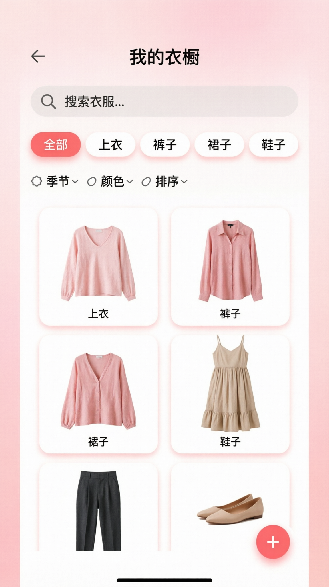

# 👗 衣橱 App - 需求文档总览

## 📋 项目信息

**项目名称：** 衣橱管理 App  
**版本：** MVP v1.0  
**目标用户：** 个人使用（老婆）  
**核心痛点：** 找不到衣服  
**技术栈：** React Native + SQLite

---

## 🎯 项目目标

### 核心目标
解决"找不到衣服"的痛点，提供快速录入和查找功能。

### MVP 目标
- ✅ 3步30秒完成录入
- ✅ 快速浏览和搜索
- ✅ 分类筛选
- ✅ 本地存储（隐私安全）

---

## 📱 页面结构

### 4个核心页面

```
┌─────────────────────────────────────┐
│          首页 (HomeScreen)          │
│  - 快速添加入口                      │
│  - 分类卡片                          │
│  - 最近添加                          │
└──────────────┬──────────────────────┘
               │
       ┌───────┴────────┐
       │                │
       ▼                ▼
┌──────────────┐  ┌──────────────┐
│  添加衣服页   │  │  衣橱浏览页   │
│ (AddClothes) │  │  (Browse)    │
│  - 拍照      │  │  - 搜索      │
│  - 分类      │  │  - 筛选      │
│  - 保存      │  │  - 浏览      │
└──────────────┘  └───────┬──────┘
                          │
                          ▼
                  ┌──────────────┐
                  │  衣服详情页   │
                  │  (Detail)    │
                  │  - 查看信息   │
                  │  - 编辑      │
                  │  - 删除      │
                  └──────────────┘
```

---

## 📄 需求文档列表

### 1️⃣ 首页需求文档
**文件：** [01-home-screen.md](./01-home-screen.md)  
**核心功能：**
- 快速添加入口
- 分类卡片展示
- 最近添加预览
- 衣服总数统计

**UI 设计：**  


---

### 2️⃣ 添加衣服页需求文档
**文件：** [02-add-clothes-screen.md](./02-add-clothes-screen.md)  
**核心功能：**
- 拍照/相册选择
- 6大分类
- 季节选择
- 备注输入

**核心流程：** 拍照 → 分类 → 保存（3步30秒）

**UI 设计：**  


---

### 3️⃣ 衣橱浏览页需求文档
**文件：** [03-wardrobe-browse-screen.md](./03-wardrobe-browse-screen.md)  
**核心功能：**
- 实时搜索
- 分类筛选
- 高级筛选（季节/颜色/排序）
- 网格浏览
- 分页加载

**UI 设计：**  


---

### 4️⃣ 衣服详情页需求文档
**文件：** [04-clothes-detail-screen.md](./04-clothes-detail-screen.md)  
**核心功能：**
- 大图展示
- 详细信息
- 编辑功能
- 删除功能

**UI 设计：**  


---

## 🎨 设计规范

### 配色方案
```
主色：温柔粉色系
- 浅粉色：#FFE5EC
- 珊瑚粉：#FF6B6B（强调色）
- 白色：#FFFFFF
- 浅灰：#F5F5F5
```

### 设计原则
- ✅ 简洁现代
- ✅ 图片为主
- ✅ 操作直观
- ✅ 女性化设计

### UI 元素
- 圆角：16px（卡片）
- 阴影：柔和阴影
- 字体：系统字体
- 图标：Emoji + 自定义图标

---

## 📊 数据库设计

### 衣服表（clothes）
```sql
CREATE TABLE clothes (
  id INTEGER PRIMARY KEY AUTOINCREMENT,
  name TEXT,              -- 名称
  category TEXT,          -- 分类（上衣/裤子/裙子/鞋子/包包/配饰）
  season TEXT,            -- 季节（春/夏/秋/冬，逗号分隔）
  color TEXT,             -- 颜色
  brand TEXT,             -- 品牌
  purchase_date DATE,     -- 购买日期
  price REAL,             -- 价格
  image_path TEXT,        -- 图片路径
  notes TEXT,             -- 备注
  created_at TIMESTAMP,   -- 创建时间
  updated_at TIMESTAMP    -- 更新时间
);
```

### 分类枚举
```javascript
const CATEGORIES = [
  { id: 'tops', name: '上衣', icon: '👕' },
  { id: 'pants', name: '裤子', icon: '👖' },
  { id: 'skirts', name: '裙子', icon: '👗' },
  { id: 'shoes', name: '鞋子', icon: '👟' },
  { id: 'bags', name: '包包', icon: '👜' },
  { id: 'accessories', name: '配饰', icon: '🧣' }
];
```

### 季节枚举
```javascript
const SEASONS = [
  { id: 'spring', name: '春', icon: '🌸' },
  { id: 'summer', name: '夏', icon: '☀️' },
  { id: 'autumn', name: '秋', icon: '🍂' },
  { id: 'winter', name: '冬', icon: '❄️' }
];
```

---

## 🔄 核心流程

### 录入流程
```
首页 → [+] 添加 → 拍照/相册 → 选择分类 → 保存
       ↓
   3步30秒完成
```

### 查找流程
```
首页 → 分类入口 → 浏览页 → [衣服] → 详情页
  或
首页 → 搜索 → 浏览页 → [衣服] → 详情页
```

### 编辑流程
```
详情页 → [编辑] → 修改信息 → 保存 → 返回详情页
```

### 删除流程
```
详情页 → [删除] → 确认对话框 → 删除 → 返回浏览页
```

---

## 🛠️ 技术栈

### 前端
- **框架：** React Native 0.73+
- **开发工具：** Expo
- **路由：** React Navigation 6
- **UI 组件：** React Native Paper / 自定义组件
- **状态管理：** React Hooks + Context

### 数据存储
- **数据库：** SQLite (react-native-sqlite-storage)
- **图片存储：** 本地文件系统
- **缓存：** AsyncStorage

### 图片处理
- **选择器：** react-native-image-crop-picker
- **裁剪：** 内置裁剪功能
- **压缩：** 80% 质量，800x800 尺寸

---

## 📅 开发计划

### 第1周：基础功能
- Day 1-2: 项目搭建 + 数据库设计
- Day 3-4: 添加衣服页
- Day 5-6: 衣橱浏览页
- Day 7: 首页

### 第2周：完善优化
- Day 1-2: 衣服详情页
- Day 3-4: 搜索和筛选功能
- Day 5-6: UI 美化 + Bug 修复
- Day 7: 测试 + 打包

---

## 📂 文件结构

```
wardrobe-app/
├── src/
│   ├── screens/          # 页面
│   │   ├── HomeScreen.tsx
│   │   ├── AddClothesScreen.tsx
│   │   ├── WardrobeBrowseScreen.tsx
│   │   └── ClothesDetailScreen.tsx
│   ├── components/       # 组件
│   │   ├── ClothesCard.tsx
│   │   ├── CategoryFilter.tsx
│   │   ├── ImagePicker.tsx
│   │   └── SearchBar.tsx
│   ├── database/         # 数据库
│   │   ├── db.ts
│   │   ├── clothesDB.ts
│   │   └── migrations.ts
│   ├── utils/            # 工具
│   │   ├── imageUtils.ts
│   │   ├── constants.ts
│   │   └── helpers.ts
│   ├── types/            # 类型定义
│   │   └── index.ts
│   └── navigation/       # 导航
│       └── AppNavigator.tsx
├── assets/               # 资源
│   └── images/
├── App.tsx               # 入口
└── package.json
```

---

## ✅ 验收标准

### 功能验收
- [ ] 所有页面可正常访问
- [ ] 录入流程完整（3步30秒）
- [ ] 搜索功能正常
- [ ] 筛选功能正常
- [ ] 编辑功能正常
- [ ] 删除功能正常
- [ ] 图片显示正常
- [ ] 数据持久化正常

### UI 验收
- [ ] 配色符合设计稿
- [ ] 布局合理
- [ ] 交互流畅
- [ ] 无明显卡顿

### 性能验收
- [ ] 首页加载 < 1秒
- [ ] 搜索响应 < 500ms
- [ ] 图片加载流畅
- [ ] 内存占用合理

---

## 📝 备注

**项目状态：** 需求文档完成 ✅  
**下一步：** 技术方案设计 / 开始开发  
**预计完成：** 2周 MVP 版本

---

*文档版本: v1.0*  
*创建时间: 2026-03-07*  
*最后更新: 2026-03-07 01:30*
